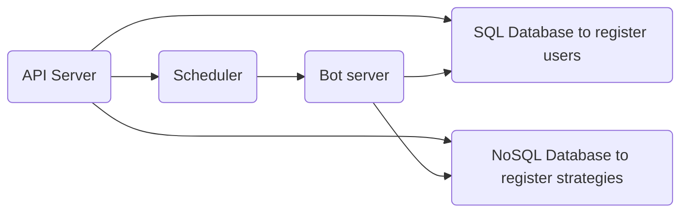

# Alphalove
Electronic dating agency. Written in Go.

## Folder structure
The semantics are taken from https://github.com/golang-standards/project-layout.

## Architecture

- The API server exposes HTTP endpoints for users to register/login and add strategies. 
- The SQL database stores user info
- The NoSQL database stores strategies set by users
- The scheduler relies on updates from the API server to update its cronjob scheduling. It uses a distributed hash table like etcd as a write-ahead-log to remember its user-to-strategy and strategy-to-schedule mappings in case it needs to restart. The scheduler pings the bot server to run each strategy at regular intervals. 
- The bot server spawns runners that are initialised with strategies that then trawl the central data pool for profiles.

## Description
Trading bots (e.g. Coinrule.com) allow you to automate trading strategy execution. Users assemble their strategy as a sequence of rules (e.g. `FOR stock in portfolio, IF price INCREASES BY 5% IN 1H THEN SELL, ELSE ...`) and let their bot execute these rules automatically. 

The same automation can apply to dating where users can get bots to filter through profiles in a central data pool to provide recommendations for them. This obviates the need for swiping left. 

Furthermore, the bot can also be taught what first steps to take after "swiping right", e.g. send a pre-written introduction, or inform the user for personal follow-up. Strategies can also control the frequency and amount of "right-swipes".

The main benefit of using bots in place of traditional dating agencies is avoiding the cost of human matchmaking.

## Development goals
The first development goal is an endpoint where a user can submit a strategy in JSON. The next goal is to write a UI where users can interactively craft strategies in an HTML form.

One stretch goal could be a catalogue of example strategies for new users to adapt or deploy straightaway.

## Endpoints for the API server
- `Register`: For new users to sign up
- `Auth`: For existing users to authenticate themselves
- `DeleteUser`: For removing users
- `PutStrategy`: For registering strategies
- `RemoveStrategy`: For deleting strategies 
- `GetStrategy`: For retrieving strategies
- `GetStrategyResults`: Retrieve results for a particular strategy

## Endpoints for the scheduler
- `AddUserID`: Put a new user id in the scheduler's schedule.
- `RemoveUserID`: Take out a user from the scheduler's schedule.
- `AddStrategyIDForUserID`: Associate a strategy id with a user id.
- `RemoveStrategyIDForUserID`: Disassociate a strategy id from a user id.

## Endpoints for the bot server
- `RunStrategyForUser`: Get a bot to run a particular strategy, and store the results for that user in the database.

## Run this project locally
- Install `helm` for drag-and-drop Kubernetes manifests for the DBMSes used in Alphalove. 
- Install `minikube` (to create a Kubernetes cluster on your local machine).
- Install `skaffold` (to deploy to the Kubernetes cluster without requiring bash scripts).
- Run `minikube start` and `skaffold dev` from the root folder.