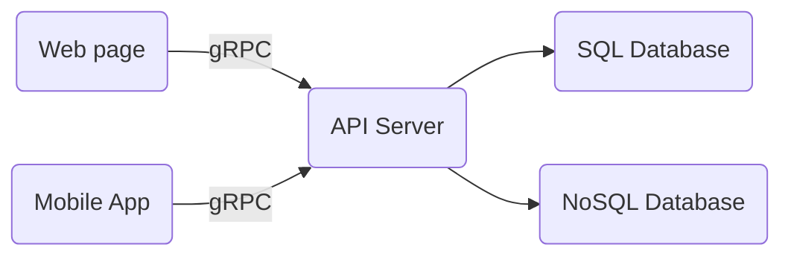

# Alphalove
An algorithmic dating agency, written in Go.

## Folder structure
The semantics are taken from https://github.com/golang-standards/project-layout.

## Architecture

- The API server runs as a gRPC service
- The SQL database stores user info
- The NoSQL database stores algorithms in Protobuf objects
  

## Description
Trading bots (e.g. Coinrule.com) allow you to automate trading strategy execution. Users assemble their strategy in a drag-and-drop UI (e.g. `IF price INCREASES BY 30% IN 1H THEN SELL, ELSE IF...`) and let their bot execute these rules automatically. 

The same can apply to dating where users can get bots to filter through profiles (read: quotes) for them so they don't have to trawl through hundreds of profiles a week deciding who to date (read: what to trade).

Using bots in place of traditional dating agencies cuts the cost of matchmaking.

## Use case
Users can deploy strategies to tell Alphalove what recommendations they would like, instead of relying on a central black-box algorithm (as in the case of existing dating apps) to learn their preferences.

Alphalove's recommender returns matches that passed their algorithmic filter.

## RPC Requests
- `Register`: For users to sign up
- `Auth`: For users to authenticate themselves
- `PutAlgo`: For registering algorithms
- `GetAlgo`: For retrieving algorithms
- `GetMatch`: Retrieve matches

## Run this project locally
- Install `helm` for drag-and-drop Kubernetes manifests for the DBMSes used in Alphalove. 
- Install `minikube` (to create a Kubernetes cluster on your local machine).
- Install `skaffold` (to deploy to the Kubernetes cluster without requiring bash scripts).
- Run `minikube start` and `skaffold dev` from the root folder.