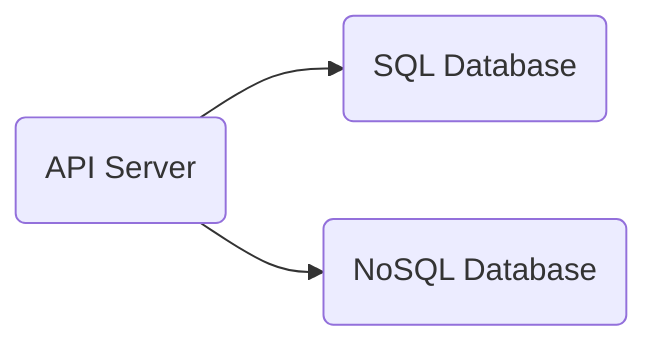

# Alphalove
An algorithmic dating agency, written in Go.

## Folder structure
The semantics are taken from https://github.com/golang-standards/project-layout.

## Architecture

- The API server exposes HTTP endpoints
- The SQL database stores user info
- The NoSQL database stores algorithms set by users
  

## Description
Trading bots (e.g. Coinrule.com) allow you to automate trading strategy execution. Users assemble their strategy as a sequence of rules (e.g. `IF price INCREASES BY 30% IN 1H THEN SELL, ELSE ...`) and let their bot execute these rules automatically. 

The same can apply to dating where users can get bots to filter through profiles for them so they don't have to "swipe left" on their own. They can also choose what first steps to take after "swiping right" - e.g., send a pre-written text, or inform the user for personal follow-up.

Using bots in place of traditional dating agencies can cut the cost of matchmaking and speed up matches.

## Use case
Users can deploy strategies to tell Alphalove what recommendations they would like, instead of relying on a behind-the-scenes black-box algorithm (as in the case of existing dating apps) to guess their preferences.

Alphalove returns matches that pass a user's algorithmic filter.

## Endpoints
- `Register`: For users to sign up
- `Auth`: For users to authenticate themselves
- `PutAlgo`: For registering algorithms
- `GetAlgo`: For retrieving algorithms
- `GetMatch`: Retrieve matches

## Run this project locally
- Install `helm` for drag-and-drop Kubernetes manifests for the DBMSes used in Alphalove. 
- Install `minikube` (to create a Kubernetes cluster on your local machine).
- Install `skaffold` (to deploy to the Kubernetes cluster without requiring bash scripts).
- Run `minikube start` and `skaffold dev` from the root folder.